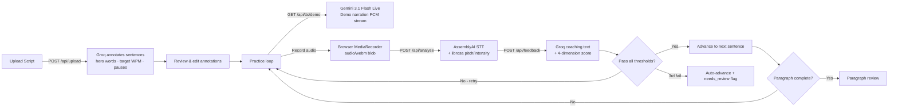

# Clario — Last Minute Presentation Practice Tool

> Practice sentence-by-sentence with demo narration, real-time acoustic analysis, and personalised coaching feedback.


<!-- screenshot or demo GIF here -->

---

## Quick Start

**Prerequisites:** Docker + Docker Compose, plus API keys for Groq, AssemblyAI, and Google AI Studio.

1. Clone the repo and copy the env template:
   ```bash
   cp backend/.env.example backend/.env
   # Fill in GROQ_API_KEY, ASSEMBLYAI_API_KEY, GEMINI_API_KEY
   ```
2. Start both services:
   ```bash
   docker compose up --build
   ```
3. Open [http://localhost](http://localhost) — backend runs on port 8000.

**Manual setup (without Docker):** See [CLAUDE.md](CLAUDE.md#running-the-project).

---

## How It Works



---

## Tech Stack

| Layer | Technology |
|-------|-----------|
| Backend | FastAPI · Python 3.12 |
| LLM (annotation + coaching) | Groq `llama-3.3-70b-versatile` |
| Speech-to-text | AssemblyAI `universal-2` |
| Demo TTS | Gemini 3.1 Flash Live |
| Coach TTS | edge-tts (Microsoft NeerjaExpressiveNeural) |
| Acoustic analysis | librosa (pyin pitch, RMS intensity) |
| Frontend | React 18 · Vite · Tailwind CSS |
| Audio pipeline | ffmpeg · Web Audio API |

---

## Scoring

All four dimensions must meet the skill-level threshold to advance:

| Dimension | Beginner | Intermediate | Advanced |
|-----------|----------|--------------|----------|
| Pacing | ≥ 60 | ≥ 75 | ≥ 85 |
| Filler words | ≥ 60 | ≥ 80 | ≥ 100 |
| Pauses | ≥ 50 | ≥ 65 | ≥ 80 |
| Emphasis | — | ≥ 60 | ≥ 75 |

After 3 failed attempts the sentence is auto-advanced and flagged for review in the final report.

---

## Why I Built It This Way

- **In-memory sessions** — avoids database setup complexity for a single-user demo; sessions are cheap (one per practice run) and persistence across restarts isn't needed for the use case.
- **Dual TTS systems** — Gemini 3.1 Flash Live for demo narration because it supports SSML prosody control (emphasis, pauses) for expressive reading; edge-tts for coach feedback because it's free, low-latency, and runs over WebSocket for gapless streaming.
- **Groq for both annotation and coaching** — `llama-3.3-70b-versatile` at Groq's inference speed fits the interactive loop; annotation is one call per upload, coaching is one call per attempt.
- **librosa + AssemblyAI, not an end-to-end model** — separating STT (word timestamps) from acoustic feature extraction (pitch, intensity) gives explainable per-word scores rather than a black-box rating.

---

## Known Limitations

- **No persistence** — sessions are in-memory; a backend restart wipes all sessions.
- **No authentication** — any user who knows a session UUID can read it.
- **No multi-user isolation** — designed for single-user demo use; rate limits are shared.
- **ffmpeg required** — the backend depends on a system `ffmpeg` binary for audio format conversion.
- **Groq rate limit** — annotation + coaching share 25 calls/min; heavy concurrent use will hit rate limits.

---

## Environment Variables

### Backend (`backend/.env`)

| Variable | Required | Description |
|----------|----------|-------------|
| `GROQ_API_KEY` | Yes | Groq API key |
| `ASSEMBLYAI_API_KEY` | Yes | AssemblyAI API key |
| `GEMINI_API_KEY` | Yes | Google AI Studio key |
| `ALLOWED_ORIGINS` | No | Comma-separated CORS origins (default: `http://localhost:5173,http://localhost:5174`) |
| `SENTRY_DSN` | No | Sentry DSN for error tracking |
| `TTS_IDLE_TIMEOUT_S` | No | Gemini TTS idle timeout in seconds (default: `90`) |

### Frontend (`frontend/.env`)

| Variable | Required | Description |
|----------|----------|-------------|
| `VITE_BACKEND_URL` | Yes | Backend HTTP base URL (e.g. `http://localhost:8000`) |
| `VITE_BACKEND_WS_URL` | Yes | Backend WebSocket base URL (e.g. `ws://localhost:8000`) |

---

## Project Structure

```
clario/
├── backend/
│   ├── main.py              # FastAPI app, CORS, rate limiting
│   ├── session_store.py     # In-memory session state (Python dict, keyed by UUID)
│   ├── requirements.txt
│   └── routers/
│       ├── upload.py        # File parsing + Groq annotation
│       ├── session.py       # Session state CRUD
│       ├── analyse.py       # AssemblyAI STT + librosa acoustic analysis
│       ├── feedback.py      # Scoring + Groq coaching text
│       ├── tts.py           # Gemini Live demo narration
│       └── live_coach.py    # WebSocket coach voice (edge-tts)
└── frontend/
    └── src/
        ├── App.jsx
        └── components/
            ├── Onboarding.jsx          # File upload + skill level
            ├── AnnotationReview.jsx    # Edit AI-generated annotations
            ├── SessionView.jsx         # Main practice orchestrator
            ├── ScriptPanel.jsx
            ├── RecordButton.jsx
            ├── ScoreCard.jsx
            ├── WaveformVisualiser.jsx
            ├── ParagraphReport.jsx
            └── SessionReport.jsx
```

---

## Deployment

### Backend — Railway or Render

1. Push this repo to GitHub.
2. Create a new **Web Service** pointing to the repo; set the root directory to `backend`.
3. Set **build command**: `pip install -r requirements.txt`
4. Set **start command**: `uvicorn main:app --host 0.0.0.0 --port $PORT`
5. Add every variable from `backend/.env.example` as a secret env var.
6. Set `ALLOWED_ORIGINS` to your deployed frontend URL, e.g. `https://clario.vercel.app`.

### Frontend — Vercel or Netlify

1. Import the repo and set **root directory** to `frontend`.
2. **Build command**: `npm run build`
3. **Output directory**: `dist`
4. Add env vars:
   - `VITE_BACKEND_URL=https://<your-backend-url>`
   - `VITE_BACKEND_WS_URL=wss://<your-backend-url>` (use `wss://` for production)
